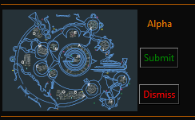

# EDMC-Ruins
A plugin to report ruin types

# How it works

When you approach one of the Guardian Ancient Ruins site the user interface will appear.

 

Left click on the map to switch to the next map
Right click to go back to the previous map.

The site type will be displayed.

Click submit to send us the data.
Click dismiss ro remove the UI without sending

The record will be recorded in a [google sheet](https://docs.google.com/spreadsheets/d/1Mowarnq_wI0UWxYWthrpCbcfCOHv8Y8sgeL_n_OwdQE/edit?gid=563300356#gid=563300356) and used to suppliment journal data.

## Watch the video

Reading too hard? Watch the video

## How to install. 
First you must install [Elite Dangerous Market Connector](https://github.com/Marginal/EDMarketConnector/blob/master/README.md)

Load the application and go to the plugins tab of the settings screen. This will show you where you will need to install the EDMC-Ruins plugin. 

Download the Source Code zip file for [the latest release](https://github.com/canonn-science/EDMC-Ruins/releases/latest) and extract the folder into the plugins directory. (this can be found under *Assets* near the bottom of the release page.

Restart EDMC
